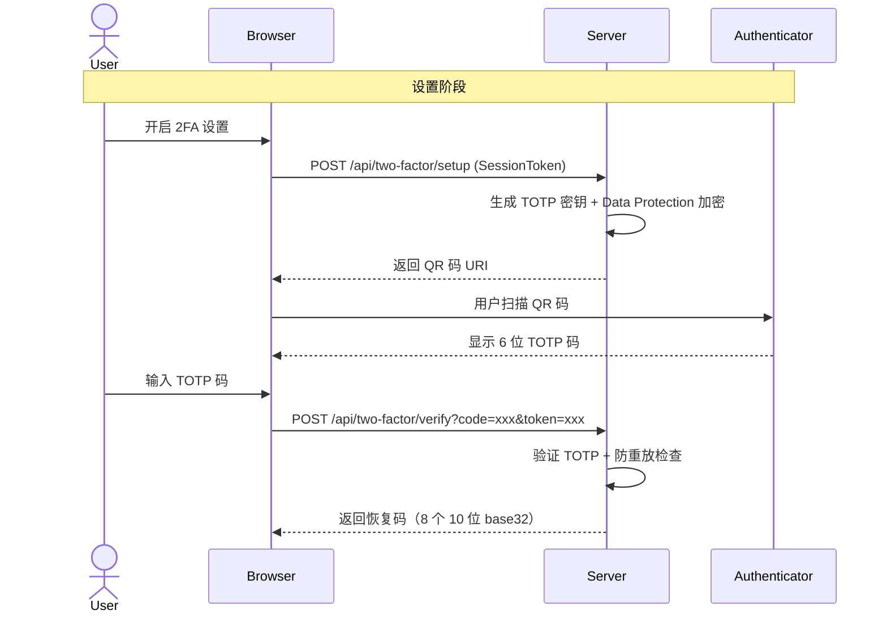

# 认证与安全

> BoxWise — 身份认证与安全架构

## 认证体系

### Server 端

- **框架:** ASP.NET Core Identity + Cookie 认证
- **用户实体:** `AppUser : IdentityUser`

  **自定义字段：**
  | 字段 | 类型 | 说明 |
  |------|------|------|
  | `ConfiguredMethods` | `TwoFactorMethod` | [Flags] 枚举，标识已配置的 2FA 方法（TOTP / Email / WebAuthn） |
  | `TotpSecretKey` | `string?` | TOTP 密钥，Data Protection API 加密存储 |
  | `PendingTotpSecretKey` | `string?` | 暂存的新 TOTP 密钥（TOTP 修改流程使用） |
  | `EmailForTwoFactor` | `string?` | 2FA 邮箱（与 `user.Email` 通过 `UpdateProfileAsync` 保持同步） |
  | `EffectiveEmailForTwoFactor` | `string?` | 计算属性：优先返回 `Email`，回退到 `EmailForTwoFactor` |
  | `TwoFactorSetupCompletedAt` | `DateTime?` | 2FA 设置完成时间 |
  | `TwoFactorGracePeriodUntil` | `DateTime?` | 2FA 宽限期截止时间 |
  | `RecoveryCodes` | `ICollection<RecoveryCode>` | 恢复码集合（导航属性） |

- **角色:** `Admin` 角色（`IdentityRole`）
- **密码策略:** 最小长度 4，无复杂度要求（家用场景）
- **Cookie 配置:**
  - `HttpOnly = true`
  - `SameSite = None`（跨端口开发需要）
  - `Secure = Always`
  - 过期时间 30 天，滑动过期
  - 401 时返回 JSON 而非重定向到登录页

### Client 端

- **认证桥接:** `CookieAuthenticationStateProvider` → 调用 `GET /api/auth/me`
- **跨源 Cookie:** `CookieHandler` 设置 `BrowserRequestCredentials.Include`
- **认证状态:** `AppState.IsAdmin` 控制管理功能可见性

### 授权策略

| 策略 | 范围 | 说明 |
|------|------|------|
| `FallbackPolicy` | 全局 | `RequireAuthenticatedUser()` — 所有端点默认需登录 |
| `AdminOnly` | 管理端点 | `RequireRole("Admin")` — Admin Razor Pages + 用户管理 |

### 端点安全

| 端点 | 授权 |
|------|------|
| `GET /api/auth/me` | `FallbackPolicy` → 401（获取当前用户信息） |
| `Login.cshtml` (Identity Razor Page) | `.AllowAnonymous()` |
| `LoginWith2fa.cshtml` (Identity Razor Page) | `.AllowAnonymous()` |
| `LoginWithRecoveryCode.cshtml` (Identity Razor Page) | `.AllowAnonymous()` |
| `GET /index.html` (SPA 回退) | `.AllowAnonymous()` |
| `MapStaticAssets()` | `.AllowAnonymous()` |
| WebAuthn 断言/注册端点 | `.AllowAnonymous()`（部分端点授权见下方） |
| 所有其他端点 | `FallbackPolicy` → 401 |

**登录/登出处理:** 不再使用 Minimal API 端点。登录、登出、2FA 验证均由 ASP.NET Core Identity 脚手架 Razor Pages（`Areas/Identity/Pages/Account/`）处理，包括：
- `Login.cshtml` — 密码登录
- `LoginWith2fa.cshtml` — TOTP 双因素验证
- `LoginWithRecoveryCode.cshtml` — 恢复码登录

### 管理员创建

- 首次启动时通过 `Admin__Password` 环境变量触发种子数据
- 默认用户名: `admin`（可通过 `Admin__Username` 覆盖）
- 密码变更时自动检测并重置

### CORS

- 开发环境: 允许 `https://localhost:5001` 跨源（Cookie + 任意头/方法）
- 生产环境: 同源部署（Server 托管 Client 静态文件），不需要 CORS

---

## 双因素认证 (2FA)

BoxWise 支持多种 2FA 方法，用户可同时启用多个方法（[Flags] 枚举）：

| 方法 | 枚举值 | 状态 | 说明 |
|------|--------|------|------|
| `TOTP` | 1 | 活跃 | 基于时间的一次性密码（Google Authenticator / Authy 等） |
| `Email` | 2 | 已退役 (v0.11) | 邮箱验证码，不再支持作为登录方式 |
| `WebAuthn` | 4 | 活跃 | 通行密钥（指纹、面容、YubiKey） |

### 2FA 流程



### TOTP（身份验证器）

- **密钥生成:** 20 字节随机密钥（`OtpNet.KeyGeneration`），Base32 编码
- **密钥保护:** 通过 `IDataProtector`（"BoxWise.TwoFactor" purpose）加密存储到 `AppUser.TotpSecretKey`
- **双密钥窗口:** 登录验证时优先检查 `TotpSecretKey`，失败时回退到 `PendingTotpSecretKey`（TOTP 修改流程）
- **防重放:** 使用 `IMemoryCache` 按 `userId:purpose:timeStepMatched` 缓存 2 分钟，防止同一时间步长重复使用
- **SessionToken:** 基于 Data Protection 的自包含令牌（5 分钟有效期），用于首次绑定验证
- **TOTP 修改流程:** 生成临时密钥存入 `PendingTotpSecretKey`，验证通过后提升为主密钥（15 分钟 SessionToken 窗口）

### WebAuthn（通行密钥）

- **库:** FIDO2 .NET Library (`Fido2NetLib`)
- **凭证存储:** `WebAuthnCredential` 实体（`Id`, `UserId`, `CredentialId`, `PublicKey`, `SignCount`, `DeviceName`, `CreatedAt`）
- **配置:** `Fido2Configuration` 中的 `ServerDomain`、`Origins`、`ServerName`
- **认证方式:** MakeCredential（注册）和 GetAssertion（登录），分别对应 `POST /api/webauthn/register/*` 和 `POST /api/webauthn/login/*`
- **Session 依赖:** 使用 `IDistributedMemoryCache` + `ISession` 存储 WebAuthn 挑战状态（5 分钟超时）
- **速率限制:** passkey-login 策略限制 WebAuthn 断言端点（默认 30 次/5 分钟，按 IP）

### 恢复码

- **生成:** `RecoveryCodeService.GenerateRecoveryCodes()` → 8 个 10 位 base32 随机码
- **存储:** SHA-256 哈希存储到 `RecoveryCode` 表（明文仅一次性展示）
- **消耗:** `VerifyRecoveryCodeAsync()` 验证成功后清除所有恢复码 + 所有 2FA 设置 + 启用 24 小时宽限期
- **重新生成:** 用户可在设置页面重新生成（旧码全部失效）
- **非消耗性验证:** `ValidateRecoveryCodeAsync()` 用于 2FA 修改流程的身份验证（不销毁码）

### 恢复码使用流程

恢复码用于用户丢失所有 2FA 设备的场景。通过 Identity 脚手架页面 `LoginWithRecoveryCode.cshtml` 验证。

成功后清除所有 2FA 设置，进入 24 小时宽限期（`TwoFactorGracePeriodUntil`），期间用户可以重新设置新的 2FA 方法。

### 管理员 2FA 重置

管理后台提供 `/api/admin/users/{userId}/two-factor/reset` 端点（受 `AdminOnly` 策略保护）：
- 清除目标用户的全部 2FA 设置（TOTP 密钥、WebAuthn 凭证、恢复码）
- 重置 `ConfiguredMethods` 为 `None`
- 清除 `TwoFactorEnabled`、`TwoFactorSetupCompletedAt`、`TwoFactorGracePeriodUntil`
- 使用速率限制 `login-per-account` 策略
- CSRF 保护通过 `CsrfValidationFilter` 验证

---

## 速率限制

三组速率限制策略，基于 `System.Threading.RateLimiting`：

| 策略名称 | 类型 | 默认限制 | 应用端点 |
|---------|------|---------|---------|
| `login-per-ip` | FixedWindow (IP) | 5 次 / 15 分钟 | 密码登录端点 |
| `passkey-login` | FixedWindow (IP) | 30 次 / 5 分钟 | WebAuthn 断言端点 |
| `login-per-account` | FixedWindow (Policy) | 5 次 / 15 分钟 | 管理员 2FA 重置端点（分区键 = userId / 用户名 / IP） |

**配置项（`appsettings.json`）：**

```json
{
  "RateLimit": {
    "LoginPermitLimit": 5,
    "LoginWindowMinutes": 15,
    "TwoFactorTotpPermitLimit": 3,
    "TwoFactorTotpWindowSeconds": 30,
    "TwoFactorEmailPermitLimit": 3,
    "TwoFactorEmailWindowMinutes": 5,
    "TwoFactorRecoveryPermitLimit": 5,
    "TwoFactorRecoveryWindowMinutes": 15
  }
}
```

超过限制时返回 HTTP 429。

**`login-per-account` 分区键生成逻辑：**
1. 优先从 `HttpContext.User` JWT/Identity claims 中提取 `NameIdentifier`
2. 后备从请求体提取用户名（`TryExtractUsernameFromBody`）
3. 最终后备使用客户端 IP 地址

---

## Data Protection 密钥环

ASP.NET Core Data Protection API 用于敏感数据加密。密钥环持久化到文件系统。

**配置（`Program.cs`）：**

```csharp
var dataProtectionKeysPath = Path.GetFullPath(Path.Combine(dataDir, "keys"));
builder.Services.AddDataProtection()
    .PersistKeysToFileSystem(new DirectoryInfo(dataProtectionKeysPath));
```

**受保护的用途：**

| Purpose | 使用方 | 加密内容 |
|---------|--------|---------|
| `"BoxWise.TwoFactor"` | `TwoFactorService` | TOTP 密钥（TotpSecretKey / PendingTotpSecretKey）、SessionToken |
| Data Protection 默认 | `SmtpConfigurationService` | SMTP 密码 |
| Data Protection 默认 | Identity 框架 | 认证 Cookie、防伪令牌 |

**密钥目录位置：** `{DataDirectory}/keys/`（默认 `data/keys/`）

**运维注意事项：**
- `data/keys/` 目录必须纳入备份范围
- Docker 部署需通过卷映射持久化 `./data:/app/data`
- 密钥环丢失后已加密数据无法解密（TOTP 密钥、SMTP 密码需重新配置）
- 密钥环自动轮转（默认 90 天生成新密钥，旧密钥保留用于解密）

---

## 数据安全

- **密码存储:** ASP.NET Core Identity 默认哈希（PBKDF2）
- **TOTP 密钥:** Data Protection API 加密（`IDataProtector.Protect()`），密文存储到 `AppUser.TotpSecretKey`
- **恢复码:** SHA-256 哈希存储（`RecoveryCode.CodeHash`），明文仅一次性展示
- **SMTP 密码:** Data Protection API 加密存储到 `smtp-config.json`
- **数据库:** SQLite 文件位于 `data/boxwise.db`
- **图片存储:** 文件系统，`ImageStorageService` 管理路径
- **HTTPS:** `app.UseHttpsRedirection()` 强制启用

## 已知问题

- **.NET 10 `GetTwoFactorAuthenticationUserAsync()` Bug**（[dotnet/aspnetcore#66929](https://github.com/dotnet/aspnetcore/issues/66929)）— 影响 2FA 用户登录流程。Workaround 已就位（内联 `HttpContext.AuthenticateAsync` + `FindByIdAsync`）。待上游修复后移除。

## 相关文件

| 文件 | 说明 |
|------|------|
| `src/BoxWise.Server/Program.cs` | Data Protection 初始化、CORS、速率限制 |
| `src/BoxWise.Server/Models/AppUser.cs` | 用户实体含 2FA 自定义字段 |
| `src/BoxWise.Server/Models/TwoFactorMethod.cs` | [Flags] 枚举 |
| `src/BoxWise.Server/Models/RecoveryCode.cs` | 恢复码实体 |
| `src/BoxWise.Server/Models/WebAuthnCredential.cs` | WebAuthn 凭证实体 |
| `src/BoxWise.Server/Services/TwoFactorService.cs` | TOTP + SessionToken |
| `src/BoxWise.Server/Services/RecoveryCodeService.cs` | 恢复码生成/验证 |
| `src/BoxWise.Server/Services/WebAuthnService.cs` | WebAuthn 核心逻辑 |
| `src/BoxWise.Server/Endpoints/AuthEndpoints.cs` | `GET /api/auth/me` |
| `src/BoxWise.Server/Endpoints/AdminTwoFactorEndpoints.cs` | 管理员 2FA 重置端点 |
| `src/BoxWise.Server/appsettings.json` | 速率限制默认值 |
